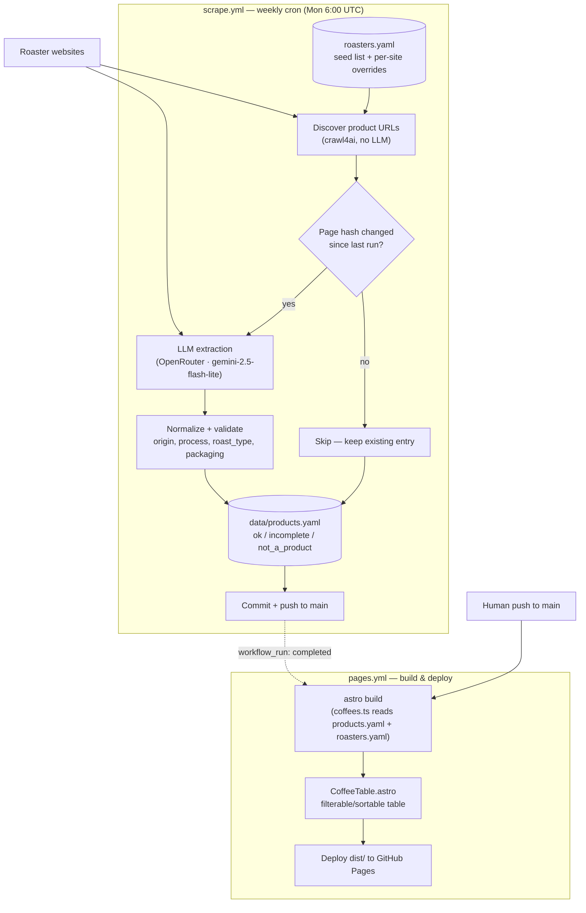

# Slovak Coffee Map

Weekly-updated catalogue of coffees available on the Slovak market, scraped from roaster websites, stored as JSON, and published via GitHub Pages (Astro + Starlight).

## How it works

See [`Architecture.md`](./Architecture.md) for the full scraping pipeline and [`CLAUDE.md`](./CLAUDE.md) for the project layout.
